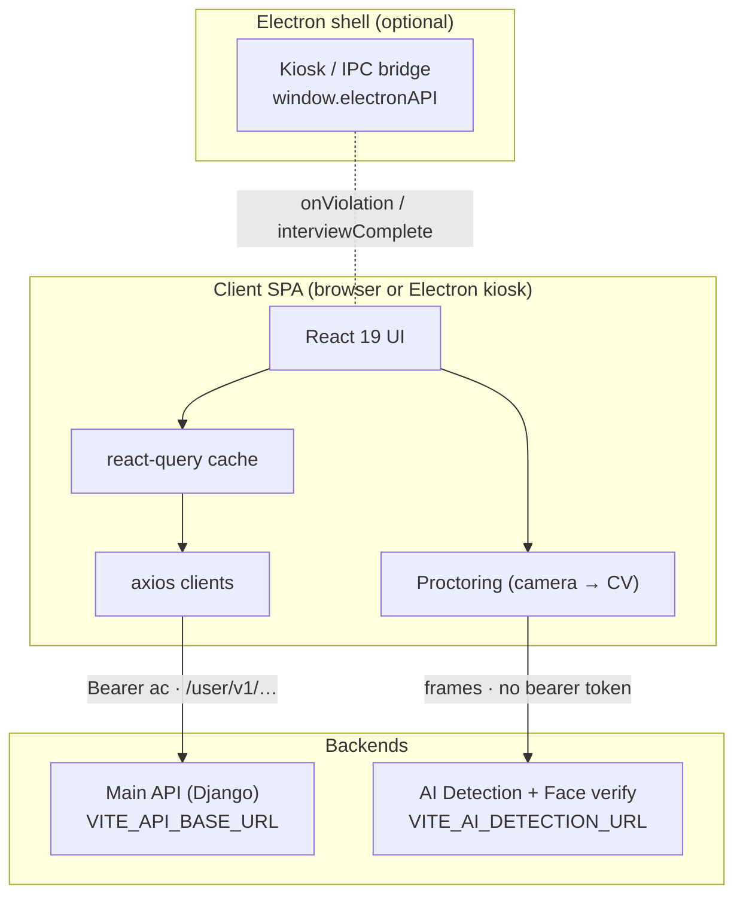
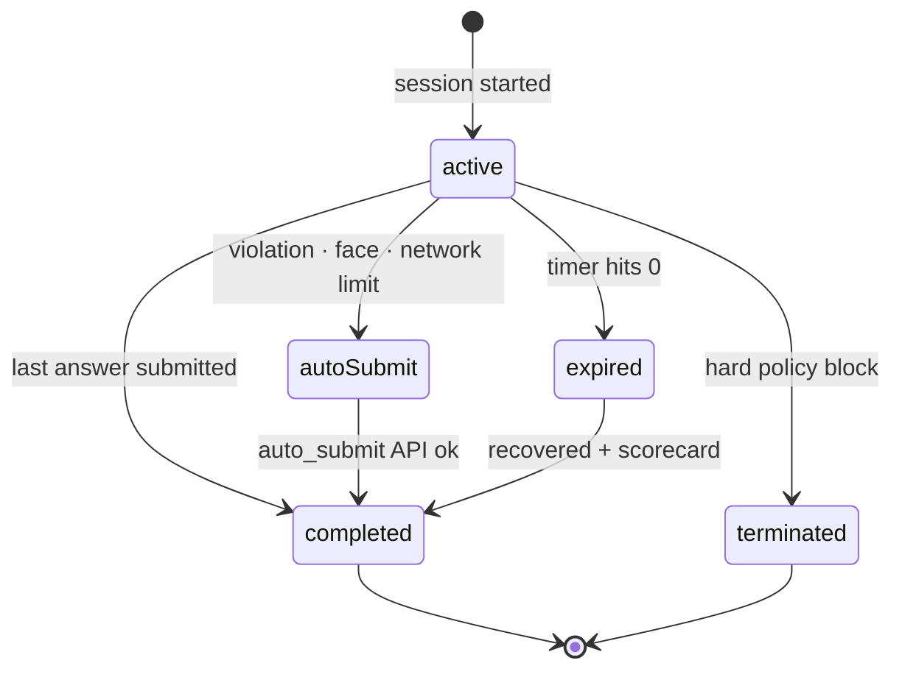
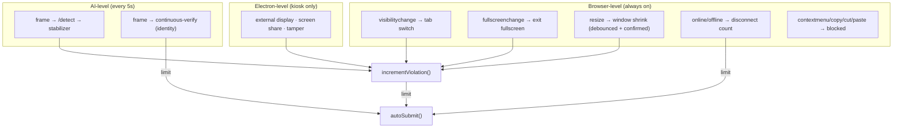

# LetsHyre — Secure AI Interview

A browser- and Electron-based, AI-proctored interview platform. Candidates arrive via a
tokenized link and proceed directly to a timed, multi-format assessment under continuous
integrity monitoring: live object/face detection, identity verification, fullscreen
lockdown, and a strike-based violation engine that auto-submits when integrity is breached.

Available in 19 languages.

> **New here?** Read [Architecture](#architecture) and [Candidate flow](#candidate-flow)
> first — they explain how the pieces fit before you open any single file.

---

## Contents

[Tech stack](#tech-stack) · [Quick start](#quick-start) · [Environment](#environment) ·
[Project structure](#project-structure) · [Architecture](#architecture) ·
[Candidate flow](#candidate-flow) · [Proctoring](#proctoring) ·
[Internationalization](#internationalization) · [Routing & auth](#routing--auth) ·
[API surface](#api-surface) · [Electron](#electron) · [Testing](#testing) ·
[Deployment](#deployment) · [Conventions](#conventions) · [Troubleshooting](#troubleshooting)

---

## Tech stack

| Area | Choice |
|---|---|
| Framework | React 19 + Vite 8 (`@vitejs/plugin-react`) |
| Routing | react-router v7 data router (`createBrowserRouter`) |
| Server state | @tanstack/react-query v5 |
| HTTP | axios (per-backend clients, auth + refresh interceptors) |
| i18n | i18next + react-i18next, 19 locales, 4 namespaces |
| Styling | Tailwind CSS v4 (`@tailwindcss/vite`), `tw-animate-css` |
| UI | Radix UI / shadcn-style primitives, `lucide-react` |
| Audio | Native MediaRecorder (`audio/webm;opus`, `audio/mp4` on Safari) |
| Notifications | sonner |
| Testing | Vitest + Testing Library (jsdom) |
| Tooling | ESLint 10, Prettier 3, pnpm |

**Path aliases** (`vite.config.js`, `vitest.config.js`, `jsconfig.json` — keep all three in
sync): `@` → `src`, plus `@components`, `@pages`, `@router`, `@hooks`, `@queries`,
`@mutations`, `@lib`, `@services`.

---

## Quick start

**Prerequisites** — Node 22, pnpm 10, a reachable Main API + AI Detection backend, and a
camera (proctoring requires it).

```bash
pnpm install
cp .env.example .env    # then fill in the values
pnpm dev                # http://localhost:5173
```

The candidate normally arrives via a tokenized link:

```
http://localhost:5173/?ac=<access_token>&rc=<refresh_token>
```

`EntryPoint` captures `ac`/`rc` into `sessionStorage`, strips them from the URL, and
redirects to `/interview`. Without valid tokens, `privateLoader` redirects to
`/unauthorized-access`.

---

## Environment

Copy `.env.example` → `.env`. **Never** add a trailing slash to a URL value.

| Variable | Required | Default | Description |
|---|---|---|---|
| `VITE_API_BASE_URL` | ✅ | — | Main Django API base |
| `VITE_AI_DETECTION_URL` | ✅ | — | AI detection / face verification base |
| `VITE_AI_MAX_VIOLATIONS_ALLOWED` | – | `3` | Proctoring strikes before auto-submit |
| `VITE_AI_FACE_MISMATCH_LIMIT` | – | `2` | Consecutive face mismatches before auto-submit |
| `VITE_AI_MAX_INTERNET_DISCONNECTS` | – | `3` | Network drops before auto-submit |
| `VITE_AI_INTERVIEW_DURATION_MINUTES` | – | `15` | Interview length |
| `VITE_AI_TERMINATION_NOTICE_SECONDS` | – | `8` | How long the termination notice holds |
| `VITE_DEBUG_LOGS` | – | `false` | `"true"` keeps verbose logs in a production build |

All tunables resolve through [`src/config/interview.js`](src/config/interview.js), which
coerces and falls back — read them from there, never from `import.meta.env` directly.

---

## Project structure

```
src/
├── main.jsx                    # Mounts <App>, QueryClient, i18n
├── App.jsx                     # <AppRouter> + <Toaster>
├── router/
│   ├── AppRouter.jsx           # createBrowserRouter from routeConfig
│   ├── routeConfig.jsx         # Single source of truth for routes
│   ├── privateLoader.js        # Token gate → /unauthorized-access
│   └── InterviewFlowGuard.jsx  # Pathless layout route for private pages
├── pages/                      # One per route
│   ├── EntryPoint.jsx          # "/" — token capture → redirect
│   ├── Interview.jsx           # Interview screen; wires every monitor together
│   └── RouteError.jsx · PageNotFound.jsx · UnauthorizedAccess.jsx
├── components/
│   ├── interview/              # Question shell, scorecard, warnings, camera panel
│   │   └── questions/          # Typing · MCQ · Code · Voice
│   ├── ui/                     # shadcn/Radix primitives
│   ├── ErrorBoundary.jsx       # Subtree boundary (crash in one panel ≠ dead page)
│   └── LanguageSelector.jsx
├── hooks/
│   ├── interview/              # useInterviewSession ⭐ · useAutoSubmitFlow · useTerminationNotice
│   ├── proctoring/             # useProctoringSystem · useViolationMonitor · useFaceMatchMonitoring
│   ├── electron/               # useElectronViolation · useInterviewComplete · useElectronScreenRecording
│   ├── useAudioRecorder.js     # MediaRecorder wrapper (voice questions)
│   └── useLocale.js
├── queries/                    # react-query useQuery hooks
├── mutations/                  # react-query useMutation hooks
├── services/
│   ├── clients/
│   │   ├── backend.js          # Main API client — auth + single-flight 401 refresh
│   │   └── aiDetection.js      # AI service client — separate origin, no bearer token
│   ├── interview.api.js · face.api.js · proctoring.api.js
├── i18n/                       # Config, language registry, locales/<lang>/<ns>.json
├── config/interview.js         # Env-backed tunables
├── lib/                        # logger · videoCapture · terminationReasons ·
│                               # violationStabilizer · electronRecording · utils
└── test/setup.js
```

**Layering rule:** components render, **hooks own behavior/state**, **services own
network**. Never call axios from a component.

---

## Architecture



The two backends are **separate origins with separate contracts**. The AI service takes no
bearer token — adding one would force a CORS preflight it does not allow.

---

## Candidate flow



- **Absolute timer** — `end_time = now + DURATION`, persisted to `sessionStorage`, so a
  refresh never resets the clock.
- **Crash/refresh recovery** — the whole session rehydrates from `sessionStorage` under
  `interview_session`.
- **Every termination path** converges on one `autoSubmit()` guarded by an in-flight ref,
  so overlapping triggers can't submit twice. Reasons are stable codes from
  [`lib/terminationReasons.js`](src/lib/terminationReasons.js) — never free text, since
  they drive both i18n lookup and UI copy.
- **TerminationNotice** explains *why* the interview ended and holds the screen for
  `VITE_AI_TERMINATION_NOTICE_SECONDS` while submission proceeds underneath.

---

## Proctoring



Detection is deliberately conservative — false strikes are worse than missed ones:

- **Temporal confirmation** — [`violationStabilizer`](src/lib/violationStabilizer.js)
  requires N consecutive identical detections before a violation counts (2 ticks for
  no-face/multi-face/objects, 3 for gaze/eyes).
- **Confidence floor** — prohibited objects (`cell phone`, `book`, `tablet`) need ≥ 0.6
  confidence. Laptops are not prohibited; the candidate is sitting at one.
- **Rate limits** — a 30s per-type cooldown plus a 15s floor between any two strikes.
- **Soft violations** (gaze, eyes closed) show a toast and never count as a strike.
- **Degraded mode** — after 3 consecutive detection failures the loop backs off
  exponentially (to 40s) and the candidate is told checks are temporarily unavailable.
- **Log flush** — batched to the backend; on unload via `fetch(keepalive)` (not
  `sendBeacon`, which cannot carry the `Authorization` header), trimming oldest records to
  stay under the 60 KB keepalive cap.

---

## Internationalization

19 locales (`ar bn de en es fr hi id it ja kn ko ml nl pt ru ta te ur`) × 4 namespaces
(`common`, `errors`, `interview`, `questions`), under `src/i18n/locales/<lang>/<ns>.json`.

- English is the fallback; missing keys in any other locale degrade to English, never to a
  raw key.
- **All user-facing copy must be an i18n key.** Passing a literal string as a prop silently
  defeats the fallback — violation and termination copy resolve keys *inside* the
  component, not at the call site.
- RTL (`ar`, `ur`) is handled with logical CSS properties (`ms-`/`me-`/`start`/`end`).
- Question and answer content comes from the backend and is not translated client-side.

---

## Routing & auth

```
/                     → EntryPoint (token capture → redirect /interview)
/interview            → privateLoader → InterviewFlowGuard → Interview (lazy)
/unauthorized-access  → UnauthorizedAccess (lazy)
*                     → PageNotFound
```

Routes are declared once in [`routeConfig.jsx`](src/router/routeConfig.jsx). The
`/interview` route sits under a pathless layout route guarded by `privateLoader`; if `ac`
or `rc` is missing from `sessionStorage` it redirects before the component mounts.

---

## API surface

Main-API calls go through [`services/clients/backend.js`](src/services/clients/backend.js),
which attaches `Authorization: Bearer <ac>` and `Accept-Language`, and on **401**
transparently calls `/user/v1/login_refresh/`, updates tokens, and replays queued requests
(single-flight refresh). A failed refresh clears the session and redirects.

| Domain | Method & path | Service fn |
|---|---|---|
| **Interview** | `POST /user/v1/candidate/interview/ai/start/` | `fetchQuestion` |
| | `POST /user/v1/candidate/interview/ai/answer/` | `submitAnswer` |
| | `POST /user/v1/candidate/interview/ai/auto_submit/force/` | `autoSubmitInterview` |
| **Voice** | `POST /user/v1/candidate/interview/voice_enroll/` | `enrollVoice` |
| | `POST /user/v1/candidate/interview/voice_compare/` | `compareVoice` |
| **Proctoring** | `POST /user/v1/candidate/interview/proctoring/log/` | `submitProctoringLogs` |
| **Auth** | `POST /user/v1/login_refresh/` | response interceptor |
| **CV detection** | `POST {AI}/api/v1/detect` | `detectFrame` |
| **Face verify** | `POST {AI}/continuous-verify/verification/register-face` | `registerFace` |
| | `POST {AI}/continuous-verify/verification/continuous-verify` | `continuousVerify` |

---

## Electron

The SPA detects an Electron host via `window.electronAPI` and **no-ops in the browser**, so
one build runs in both.

- [`useElectronViolation`](src/hooks/electron/useElectronViolation.js) — OS-level events
  (external display, screen share, tamper) routed through the same violation modal and
  counter. Events arriving before the session is ready are buffered and replayed.
- [`useInterviewComplete`](src/hooks/electron/useInterviewComplete.js) — signals the shell
  exactly once when the session ends, so it can lift kiosk mode.
- [`useElectronScreenRecording`](src/hooks/electron/useElectronScreenRecording.js) — screen
  capture lifecycle tied to session state.

---

## Testing

```bash
pnpm test          # single run
pnpm test:watch    # watch mode
```

Vitest + Testing Library in jsdom (`src/test/setup.js`), globals enabled — no need to
import `describe`/`it`/`expect`. Colocate a test as `<module>.test.js` beside its subject.

Coverage is weighted toward logic that can end someone's interview: the session state
machine, every auto-submit trigger, violation counting and suppression, detection
stabilization, and termination-reason copy resolution.

> When a module is moved or renamed, update its `vi.mock(...)` specifier to match the new
> import path exactly — Vitest resolves mocks by specifier, and a stale one fails loudly.

---

## Deployment

Firebase Hosting, project `interview-letshyre-uat`, via GitHub Actions.

| Workflow | Trigger |
|---|---|
| [`ci.yml`](.github/workflows/ci.yml) | every PR and push — lint, test, build |
| [`deploy.yml`](.github/workflows/deploy.yml) | push to `main`, or manual dispatch |

Deploys run under the `production` GitHub Environment, restricted to `main`. Build-time
config comes from **environment variables** (`vars.*`) for the `VITE_*` values; the only
**secret** is `FIREBASE_SERVICE_ACCOUNT`, scoped to `roles/firebasehosting.admin`.

`VITE_*` values are inlined at build time, so changing one requires a redeploy, not a
restart. To roll back a bad release: `firebase hosting:rollback`.

---

## Conventions

```bash
pnpm dev            # Vite dev server (HMR)
pnpm build          # Production build → dist/
pnpm preview        # Serve the production build
pnpm lint           # ESLint (flat config)
pnpm test           # Vitest
pnpm format         # Prettier write
pnpm format:check   # Prettier check
```

- **Components render; hooks own state/effects; services own network.**
- **Queries live in `queries/`, mutations in `mutations/`** — not in `hooks/`.
- **Storage keys are plain strings** (`ac`, `rc`, `interview_session`). Reuse the exact
  spelling; a typo silently breaks auth.
- **Electron access is always feature-detected** (`window.electronAPI?.…`).
- **Tunables come from `config/interview.js`**, never a hardcoded literal — a hardcoded `3`
  in UI copy will lie the moment the env value changes.
- **Log through `lib/logger`**, not `console` — it is silenced in production except errors.

---

## Troubleshooting

| Symptom | Likely cause |
|---|---|
| Immediate redirect to `/unauthorized-access` | Missing/invalid `ac`/`rc` in the URL or `sessionStorage` |
| Requests 404 or hit a strange host | A URL env value has a **trailing slash** |
| Interview auto-submits unexpectedly | Violation, face-mismatch, or network-drop limit reached — check the reason on the termination notice |
| "Proctoring checks temporarily unavailable" | Degraded mode: 3+ consecutive detection failures — check the AI service |
| Raw `violations.…` / `termination.…` text on screen | A missing i18n key in `en/interview.json` |
| Camera prompts blocked | Browser permissions, or plain `http` on a non-localhost origin |

### Manually exercising the anti-cheat flow

1. Start an interview and enter fullscreen.
2. Press `Esc` or `Alt+Tab` → expect a strike modal.
3. Refresh → the timer persists, it does not reset.
4. Try `Ctrl+C`/`Ctrl+V` or right-click → blocked.
5. Reach the strike limit → termination notice, then automatic submission.
