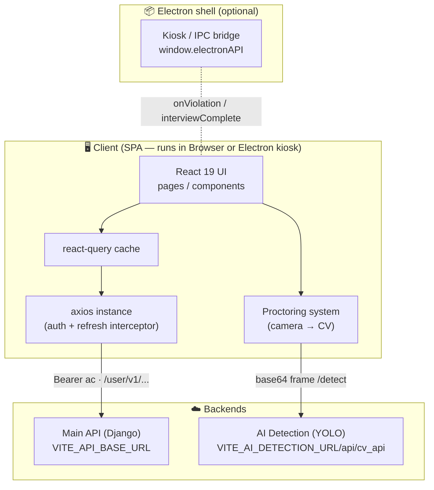
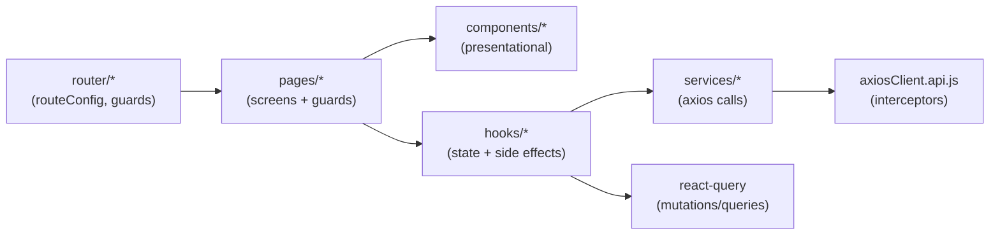
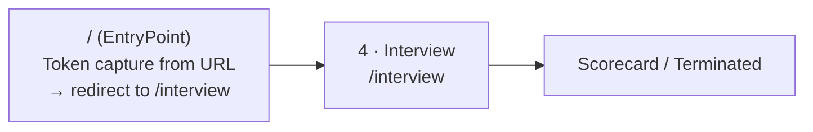
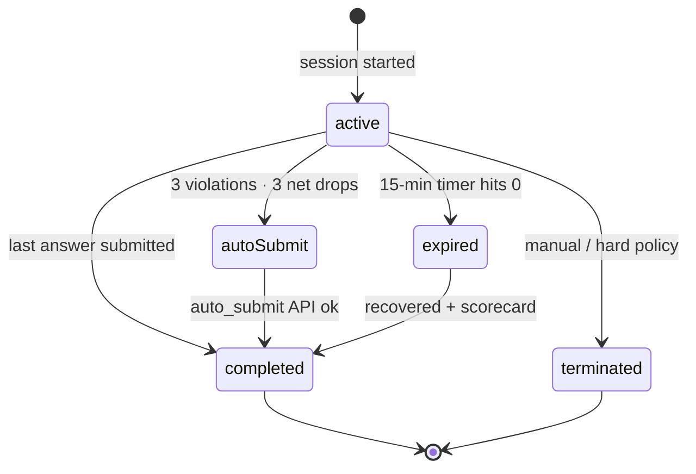
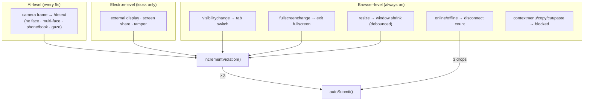

# LetsHyre — Secure AI Interview

A browser- and Electron-based, AI-proctored interview platform. Candidates arrive via a
tokenized link and proceed directly to a timed, multi-format assessment under continuous
integrity monitoring: live object/face detection, fullscreen lockdown, and a strike-based
violation engine that auto-submits the interview when integrity is breached.

> **New to this codebase?** Read [Architecture](#-architecture) and the
> [Candidate flow](#-candidate-flow--state-machine) first — they explain *how the pieces
> fit* before you dive into any single file. Then skim [Project structure](#-project-structure)
> and [API surface](#-api-surface).

---

## 📑 Table of Contents

- [Overview](#-overview)
- [Tech stack](#-tech-stack)
- [Architecture](#-architecture)
- [Candidate flow & state machine](#-candidate-flow--state-machine)
- [Proctoring & anti-cheat subsystem](#-proctoring--anti-cheat-subsystem)
- [Project structure](#-project-structure)
- [Getting started](#-getting-started)
- [Environment variables](#-environment-variables)
- [Routing & auth gate](#-routing--auth-gate)
- [API surface](#-api-surface)
- [Electron integration](#-electron-integration)
- [Conventions & scripts](#-conventions--scripts)
- [Troubleshooting & gotchas](#-troubleshooting--gotchas)

---

## 🔭 Overview

The app is a **single-page React application** that a candidate opens via a signed link
(access/refresh tokens arrive as URL query params). It captures the tokens, redirects to
the interview, and talks to **two independent backends**:

| Service | Purpose | Base URL (env) |
|---|---|---|
| **Main API** (Django) | Auth/refresh, interview lifecycle, answers, proctoring logs | `VITE_API_BASE_URL` |
| **AI Detection** (CV) | Per-frame object/face detection (YOLO) for proctoring | `VITE_AI_DETECTION_URL` |

When packaged inside the companion **Electron kiosk shell**, the same SPA additionally
receives OS-level violation signals (external display, screen share, process tampering)
and emits a completion signal to lift kiosk mode — all behind feature-detected no-ops so
the identical build runs in a plain browser.

---

## 🛠 Tech stack

| Area | Choice |
|---|---|
| Framework | **React 19** + **Vite 8** (ESM, `@vitejs/plugin-react`) |
| Routing | **react-router v7** data router (`createBrowserRouter`) |
| Server state | **@tanstack/react-query v5** |
| HTTP | **axios** (instance + auth/refresh interceptors) |
| Styling | **Tailwind CSS v4** (`@tailwindcss/vite`), `tw-animate-css` |
| UI primitives | **Radix UI** / shadcn-style components, **lucide-react** icons |
| Animation | **framer-motion** |
| Forms / validation | **react-hook-form** + **zod** |
| Audio | Native **MediaRecorder** API (`audio/webm;opus`, `audio/mp4` on Safari) |
| Notifications | **sonner** |
| Tooling | ESLint 10, Prettier 3 |

> Path alias: `@` → `src` (and `@components`, `@hooks` where used). Configured in
> `vite.config.js` / `jsconfig.json`.

---

## 🏗 Architecture

### System context



### Frontend layering



**Layering rule of thumb:** components render, **hooks own behavior/state**, **services own
network**. The session "brain" is [`useInterviewSession`](src/hooks/useInterviewSession.js) —
it holds the state machine, timer, violation counters, and auto-submit triggers.

---

## 🔄 Candidate flow & state machine

A candidate arrives via a tokenized link, which is immediately parsed at the entry point
and redirected to the interview:



Within the interview, the session is a small state machine:



Key properties (see [`useInterviewSession`](src/hooks/useInterviewSession.js)):

- **Absolute timer** — `end_time = now + DURATION`; persisted to `sessionStorage`, so a
  refresh never resets the clock.
- **Crash/refresh recovery** — the full session (current question, violation counts, end
  time) is rehydrated from `sessionStorage` under `interview_session`.
- **Auto-submit triggers** — 3 proctoring violations, 3 internet disconnects, or timer
  expiry all converge on a single `autoSubmit()` path with offline-retry on reconnect.

---

## 🛡 Proctoring & anti-cheat subsystem

Multiple independent monitors run concurrently during an active interview:



- **Violation UI** — a single [`ViolationWarning`](src/components/interview/ViolationWarning.jsx)
  modal is reused for every source; the open/closed state is tracked via a ref to avoid
  re-entrancy.
- **Proctoring logs** are batched and flushed to the Django backend, with a `sendBeacon`
  safety-net flush on page unload (see [`useProctoringSystem`](src/hooks/useProctoringSystem.js)).
- **Tunables** live in env (`VITE_AI_MAX_VIOLATIONS_ALLOWED`, `VITE_AI_INTERVIEW_DURATION_MINUTES`)
  and in `useProctoringSystem` (`DETECT_INTERVAL_MS`, prohibited-object set).

---

## 📁 Project structure

```
src/
├── main.jsx                  # Entry: mounts <App>, QueryClient
├── App.jsx                   # Root: <AppRouter> + <Toaster>
├── router/
│   ├── AppRouter.jsx         # createBrowserRouter from routeConfig
│   ├── routeConfig.jsx       # Single source of truth for routes
│   ├── PrivateRoute.js       # privateLoader — token gate (redirects to /unauthorized-access)
│   └── InterviewFlowGuard.jsx# Pathless layout route wrapper for private pages
├── pages/                    # Screen-level components (one per route)
│   ├── EntryPoint.jsx        # "/" — token capture from URL + redirect to /interview
│   ├── interview.jsx         # The interview screen (orchestrates all monitors)
│   └── Error.jsx / PageNotFound.jsx / UnauthorizedAccess.jsx
├── components/
│   ├── interview/            # Question renderer, scorecard, warnings, video panel
│   │   └── questions/        # Typing · MCQ · Code · Voice
│   └── ui/                   # shadcn/Radix primitives (design kit)
├── hooks/
│   ├── useInterviewSession.js# ⭐ Session state machine + auto-submit
│   ├── useProctoringSystem.js# Camera → CV detection loop + log batching
│   ├── useAudioRecorder.js   # Native MediaRecorder wrapper (voice questions)
│   └── electron/             # useElectronViolation · useInterviewComplete
├── services/                 # axios clients + endpoint wrappers (one file per domain)
│   ├── axiosClient.api.js    # Auth interceptor + refresh logic
│   ├── interview.api.js      # Interview start / answer / auto-submit
│   └── proctoring.api.js     # CV detection + proctoring log flush
├── config/
│   └── interview.js          # Env-backed tunables (MAX_VIOLATIONS, DURATION, etc.)
└── lib/
    ├── videoCapture.js       # Frame capture utilities (base64, File)
    └── logger.js             # Dev/prod logger (silent in prod except errors)
```

---

## 🚀 Getting started

### Prerequisites

- **Node.js ≥ 20** and **pnpm** (lockfile is `pnpm-lock.yaml`)
- A reachable **Main API** and **AI Detection** backend (or dev URLs)
- A device with a **camera** (the proctoring system needs it)

### Install & run

```bash
# 1. Install
pnpm install

# 2. Configure environment
cp .env.example .env        # then edit values (see table below)

# 3. Start the dev server
pnpm dev                    # http://localhost:5173
```

### Entering the app

The candidate normally arrives via a tokenized link:

```
http://localhost:5173/?ac=<access_token>&rc=<refresh_token>
```

`EntryPoint` captures `ac`/`rc` into `sessionStorage`, strips them from the URL, and
redirects to `/interview`. Without valid tokens the `privateLoader` sends the user to
`/unauthorized-access`.

---

## 🔐 Environment variables

Copy `.env.example` → `.env`. **Do not** add a trailing slash to URL values.

| Variable | Required | Example | Description |
|---|---|---|---|
| `VITE_API_BASE_URL` | ✅ | `https://api.letshyre.com` | Main Django API base (no trailing slash) |
| `VITE_AI_DETECTION_URL` | ✅ | `https://ai.letshyre.com` | Base for CV detection |
| `VITE_MAIN_WEBSITE_URL` | – | `https://letshyre.com` | Marketing site link target |
| `VITE_AI_MAX_VIOLATIONS_ALLOWED` | – | `3` | Strikes before auto-submit (default 3) |
| `VITE_AI_INTERVIEW_DURATION_MINUTES` | – | `15` | Interview length in minutes (default 15) |

---

## 🧭 Routing & auth gate

Routes are declared once in [`routeConfig.jsx`](src/router/routeConfig.jsx) and consumed by
`AppRouter`. The `/interview` route sits under a pathless layout route guarded by
`privateLoader` (token check). If either `ac` or `rc` is missing from `sessionStorage`,
the loader redirects the user to `/unauthorized-access` before the component mounts.

```
/                  → EntryPoint (token capture → redirect /interview)
/interview         → privateLoader check → InterviewFlowGuard → Interview
/unauthorized-access → UnauthorizedAccess
*                  → NotFoundPage
```

---

## 🌐 API surface

All Main-API calls go through [`axiosClient.api.js`](src/services/axiosClient.api.js), which:
attaches `Authorization: Bearer <ac>`, and on **401** transparently calls
`/user/v1/login_refresh/`, updates tokens, and replays the queued requests (single-flight
refresh). A failed refresh clears the session and redirects to `/unauthorized-access`.

| Domain | Method & path | Service fn |
|---|---|---|
| **Interview** | `POST /user/v1/candidate/interview/ai/start/` | `fetchQuestion` |
| | `POST /user/v1/candidate/interview/ai/answer/` | `submitAnswer` |
| | `POST /user/v1/candidate/interview/ai/auto_submit/force/` | `autoSubmitInterview` |
| **Proctoring** | `POST /user/v1/candidate/interview/proctoring/log/` | `submitProctoringLogs` |
| **Auth (interceptor)** | `POST /user/v1/login_refresh/` | axios response interceptor |
| **CV detection** | `POST {AI}/api/cv_api/api/v1/detect` | `detectFrame` |

---

## 📦 Electron integration

The SPA detects an Electron host via `window.electronAPI` and **no-ops in the browser**:

- [`useElectronViolation`](src/hooks/electron/useElectronViolation.js) — subscribes to
  `window.electronAPI.onViolation(handler)` for OS-level events (external display, screen
  share, process tamper) and routes them through the same violation modal + counter.
- [`useInterviewComplete`](src/hooks/electron/useInterviewComplete.js) — calls
  `window.electronAPI.interviewComplete(reason)` exactly once when the session ends, so the
  shell can lift kiosk mode and restore window controls.

No Electron, no problem: every call is feature-detected, so the identical web build runs
unchanged in a normal browser.

---

## 🧱 Conventions & scripts

```bash
pnpm dev            # Vite dev server (HMR)
pnpm build          # Production build → dist/
pnpm preview        # Serve the production build locally
pnpm lint           # ESLint (flat config: eslint.config.js)
pnpm format         # Prettier write
pnpm format:check   # Prettier check (CI)
```

Conventions:

- **Components render; hooks own state/effects; services own network.** Don't call axios
  from a component — add/extend a `services/*` wrapper and a hook.
- **Storage keys are plain strings** (`ac`, `rc`, `interview_session`). Reuse the existing
  spelling exactly — a typo silently breaks auth.
- **Electron access is always feature-detected** (`window.electronAPI?.…`).

---

## 🩺 Troubleshooting & gotchas

| Symptom | Likely cause |
|---|---|
| Redirected to `/unauthorized-access` immediately | Missing/invalid `ac`/`rc` tokens in the URL or sessionStorage |
| Requests 404 / hit a weird host | A URL env value has a **trailing slash** (must not) |
| Interview auto-submits unexpectedly | 3 proctoring violations or 3 network drops — check the console logs |
| Camera/mic prompts blocked | Browser permissions, or running over plain `http` on a non-localhost origin |

### Manually exercising the anti-cheat flow

1. Start an interview and enter fullscreen.
2. Press `Esc` (exit fullscreen) or `Alt+Tab` (switch window) → expect a strike modal.
3. Refresh the page → the timer should **persist**, not reset.
4. Try `Ctrl+C`/`Ctrl+V` or right-click → expect them blocked.
5. Accumulate 3 strikes → expect automatic submission/termination.
