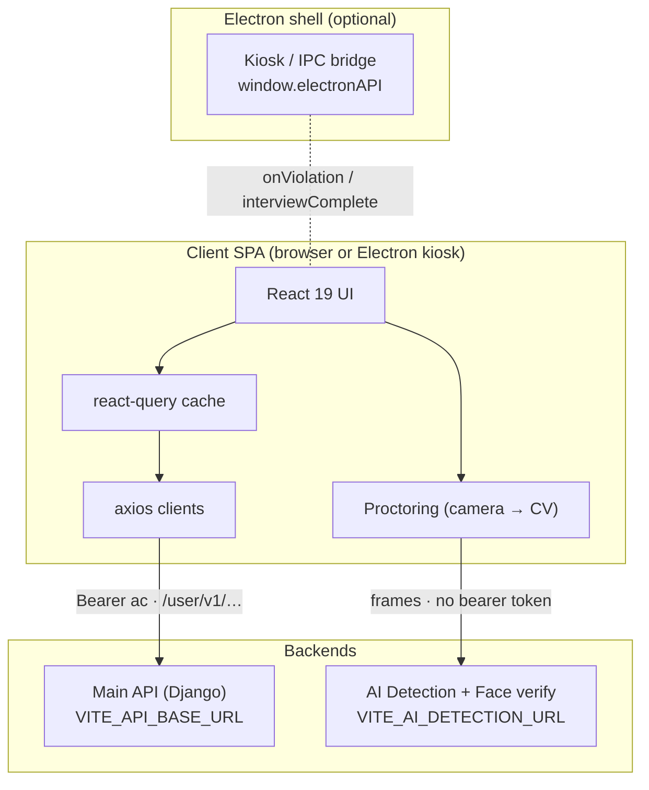
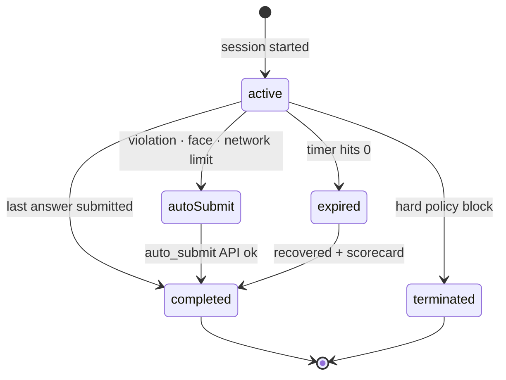
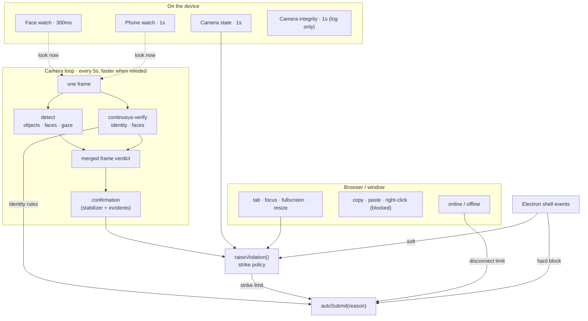

# LetsHyre — Secure AI Interview

A browser- and Electron-based, AI-proctored interview platform. Candidates arrive via a
tokenized link and proceed directly to a timed, multi-format assessment under continuous
integrity monitoring: live object/face detection, identity verification, fullscreen
lockdown, and a strike-based violation engine that auto-submits when integrity is breached.

Available in 19 languages.

> **New here?** Read [Architecture](#architecture) and [Candidate flow](#candidate-flow)
> first — they explain how the pieces fit before you open any single file.

---

## Contents

[Tech stack](#tech-stack) · [Quick start](#quick-start) · [Environment](#environment) ·
[Project structure](#project-structure) · [Architecture](#architecture) ·
[Candidate flow](#candidate-flow) · [Proctoring](#proctoring) ·
[Internationalization](#internationalization) · [Routing & auth](#routing--auth) ·
[API surface](#api-surface) · [Electron](#electron) · [Testing](#testing) ·
[Developer tools](#developer-tools) · [Deployment](#deployment) · [Conventions](#conventions) ·
[Troubleshooting](#troubleshooting)

---

## Tech stack

| Area          | Choice                                                          |
| ------------- | --------------------------------------------------------------- |
| Framework     | React 19 + Vite 8 (`@vitejs/plugin-react`)                      |
| Routing       | react-router v7 data router (`createBrowserRouter`)             |
| Server state  | @tanstack/react-query v5                                        |
| HTTP          | axios (per-backend clients, auth + refresh interceptors)        |
| i18n          | i18next + react-i18next, 19 locales, 4 namespaces               |
| Styling       | Tailwind CSS v4 (`@tailwindcss/vite`), `tw-animate-css`         |
| UI            | Radix UI / shadcn-style primitives, `lucide-react`              |
| Audio         | Native MediaRecorder (`audio/webm;opus`, `audio/mp4` on Safari) |
| Notifications | sonner                                                          |
| Testing       | Vitest + Testing Library (jsdom)                                |
| Tooling       | ESLint 10, Prettier 3, pnpm                                     |

**Path aliases** (`vite.config.js`, `vitest.config.js`, `jsconfig.json` — keep all three in
sync): `@` → `src`, plus `@components`, `@pages`, `@router`, `@hooks`,
`@mutations`, `@lib`, `@services`.

---

## Quick start

**Prerequisites** — Node 22, pnpm 10, a reachable Main API + AI Detection backend, and a
camera (proctoring requires it).

```bash
pnpm install
cp .env.example .env    # then fill in the values
pnpm dev                # http://localhost:5173
```

The candidate normally arrives via a tokenized link:

```
http://localhost:5173/?ac=<access_token>&rc=<refresh_token>
```

`EntryPoint` captures `ac`/`rc` into `sessionStorage`, strips them from the URL, and
redirects to `/interview`. Without valid tokens, `privateLoader` redirects to
`/unauthorized-access`.

---

## Environment

Copy `.env.example` → `.env`. **Never** add a trailing slash to a URL value.

| Variable                             | Required | Default | Description                                                        |
| ------------------------------------ | -------- | ------- | ------------------------------------------------------------------ |
| `VITE_API_BASE_URL`                  | ✅       | —       | Main Django API base                                               |
| `VITE_AI_DETECTION_URL`              | ✅       | —       | AI detection / face verification base                              |
| `VITE_AI_MAX_VIOLATIONS_ALLOWED`     | –        | `3`     | Proctoring strikes before auto-submit                              |
| `VITE_AI_FACE_MISMATCH_LIMIT`        | –        | `2`     | Face mismatches with no match between them before auto-submit      |
| `VITE_AI_FACE_MISMATCH_TOTAL_LIMIT`  | –        | `3`     | Face mismatches in the whole interview before auto-submit          |
| `VITE_AI_FACE_UNCLEAR_HINT_SECONDS`  | –        | `30`    | No clear face this long shows a hint                               |
| `VITE_AI_FACE_UNCLEAR_LIMIT_SECONDS` | –        | `60`    | No clear face this long counts as a mismatch                       |
| `VITE_AI_FACE_MISMATCH_BELOW`        | –        | `0.4`   | Similarity must be below this to count as a mismatch               |
| `VITE_AI_FACE_STRONG_MISMATCH_BELOW` | –        | off     | Similarity below this on a clear frame ends the interview at once  |
| `VITE_AI_MAX_INTERNET_DISCONNECTS`   | –        | `3`     | Network drops before auto-submit                                   |
| `VITE_MIN_DESKTOP_VERSION`           | –        | –       | Oldest desktop app that may start an interview (e.g. `1.4.5`)      |
| `VITE_AI_INTERVIEW_DURATION_MINUTES` | –        | `15`    | Interview length                                                   |
| `VITE_AI_TERMINATION_NOTICE_SECONDS` | –        | `12`    | How long the termination notice holds                              |
| `VITE_AI_HELD_RESTRIKE_SECONDS`      | –        | `30`    | Object or camera-off still there this long adds one more strike    |
| `VITE_AI_OBJECT_CONFIDENCE_FLOOR`    | –        | `0.35`  | Confidence an object needs before it can raise a violation         |
| `VITE_AI_PROHIBIT_LAPTOP`            | –        | `true`  | `false` stops laptops counting as prohibited objects               |
| `VITE_AI_SHADOW_LABELS`              | –        | `tv`    | Object labels logged but never shown or counted                    |
| `VITE_AI_SHADOW_RULES`               | –        | `gaze`  | Rules logged but never shown or counted; `none` enforces all       |
| `VITE_AI_LOCAL_FACE_WATCH`           | –        | `true`  | On-device face count that triggers an immediate check; `false` off |
| `VITE_AI_LOCAL_OBJECT_WATCH`         | –        | `true`  | On-device phone watch triggering an immediate check; `false` off   |
| `VITE_DEBUG_LOGS`                    | –        | `false` | `"true"` keeps verbose logs in a production build                  |

All tunables resolve through [`src/config/interview.js`](src/config/interview.js), which
coerces and falls back — read them from there, never from `import.meta.env` directly.

---

## Project structure

```
src/
├── main.jsx                    # Mounts <App>, QueryClient, i18n
├── App.jsx                     # <AppRouter> + <Toaster>
├── router/
│   ├── AppRouter.jsx           # createBrowserRouter from routeConfig
│   ├── routeConfig.jsx         # Single source of truth for routes
│   ├── privateLoader.js        # Token gate → /unauthorized-access
│   └── InterviewFlowGuard.jsx  # Pathless layout route for private pages
├── pages/                      # One per route
│   ├── EntryPoint.jsx          # "/" — token capture → redirect
│   ├── Interview.jsx           # Interview screen; wires every monitor together
│   └── RouteError.jsx · PageNotFound.jsx · UnauthorizedAccess.jsx
├── components/
│   ├── interview/              # Question shell, scorecard, warnings, camera panel
│   │   └── questions/          # Typing · MCQ · Code · Voice
│   ├── ui/                     # shadcn/Radix primitives
│   ├── ErrorBoundary.jsx       # Subtree boundary (crash in one panel ≠ dead page)
│   └── LanguageSelector.jsx
├── hooks/
│   ├── interview/              # useInterviewSession ⭐ · useAutoSubmitFlow · useTerminationNotice
│   ├── proctoring/             # useProctoringSystem · useViolationMonitor · useFaceMatchMonitoring ·
│   │                           # useLocalFaceWatch · useLocalObjectWatch · useCameraIntegrity
│   ├── electron/               # useElectronViolation · useInterviewComplete · useElectronScreenRecording
│   ├── useAudioRecorder.js     # MediaRecorder wrapper (voice questions)
│   └── useLocale.js
├── queries/                    # react-query useQuery hooks
├── mutations/                  # react-query useMutation hooks
├── services/
│   ├── clients/
│   │   ├── backend.js          # Main API client — auth + single-flight 401 refresh
│   │   └── aiDetection.js      # AI service client — separate origin, no bearer token
│   ├── interview.api.js · face.api.js · proctoring.api.js
├── i18n/                       # Config, language registry, locales/<lang>/<ns>.json
├── config/interview.js         # Env-backed tunables
├── lib/                        # logger · videoCapture · terminationReasons ·
│                               # violationStabilizer · baselineTracker · incidentTracker ·
│                               # strikePolicy · violationCopy · violationLog ·
│                               # localFaceDetector · localObjectDetector · electronRecording · utils
└── test/setup.js
```

**Layering rule:** components render, **hooks own behavior/state**, **services own
network**. Never call axios from a component.

---

## Architecture


```mermaid
flowchart TB
    subgraph Client["Client SPA (browser or Electron kiosk)"]
        UI["React 19 UI"]
        RQ["react-query cache"]
        AX["axios clients"]
        PS["Proctoring (camera → CV)"]
        UI --> RQ --> AX
        UI --> PS
    end

    subgraph Electron["Electron shell (optional)"]
        Kiosk["Kiosk / IPC bridge<br/>window.electronAPI"]
    end

    subgraph Backends["Backends"]
        API["Main API (Django)<br/>VITE_API_BASE_URL"]
        CV["AI Detection + Face verify<br/>VITE_AI_DETECTION_URL"]
    end

    AX -->|"Bearer ac · /user/v1/…"| API
    PS -->|"frames · no bearer token"| CV
    Kiosk -. "onViolation / interviewComplete" .- UI
```

The two backends are **separate origins with separate contracts**. The AI service takes no
bearer token — adding one would force a CORS preflight it does not allow.

---

## Candidate flow


```mermaid
stateDiagram-v2
    [*] --> active : session started
    active --> completed : last answer submitted
    active --> expired : timer hits 0
    active --> terminated : hard policy block
    active --> autoSubmit : violation · face · network limit
    autoSubmit --> completed : auto_submit API ok
    expired --> completed : recovered + scorecard
    completed --> [*]
    terminated --> [*]
```

- **Absolute timer** — `end_time = now + DURATION`, persisted to `sessionStorage`, so a
  refresh never resets the clock.
- **Crash/refresh recovery** — the whole session rehydrates from `sessionStorage` under
  `interview_session`.
- **Every termination path** converges on one `autoSubmit()` guarded by an in-flight ref,
  so overlapping triggers can't submit twice. Reasons are stable codes from
  [`lib/terminationReasons.js`](src/lib/terminationReasons.js) — never free text, since
  they drive both i18n lookup and UI copy.
- **TerminationNotice** explains _why_ the interview ended and holds the screen for
  `VITE_AI_TERMINATION_NOTICE_SECONDS` while submission proceeds underneath.

---

## Proctoring

Everything that watches the candidate, how a signal becomes a warning or a strike, and how
the interview ends. The rule behind every threshold: **a false strike is worse than a
missed one**, so nothing strikes on a single noisy frame, and anything we are still
measuring is logged without being shown (shadow mode).


```mermaid
flowchart TB
    subgraph Device["On the device"]
        LF["Face watch · 300ms"]
        LO["Phone watch · 1s"]
        CAM["Camera state · 1s"]
        CI["Camera integrity · 1s (log only)"]
    end
    subgraph Loop["Camera loop · every 5s, faster when needed"]
        F["one frame"] --> DET["detect<br/>objects · faces · gaze"]
        F --> VER["continuous-verify<br/>identity · faces"]
        DET & VER --> MERGE["merged frame verdict"]
        MERGE --> STAB["confirmation<br/>(stabilizer + incidents)"]
    end
    subgraph Page["Browser / window"]
        WIN["tab · focus · fullscreen · resize"]
        IN["copy · paste · right-click (blocked)"]
        NET["online / offline"]
    end
    EL["Electron shell events"]

    LF & LO -.->|"look now"| F
    STAB --> RV["raiseViolation()<br/>strike policy"]
    CAM --> RV
    WIN --> RV
    EL -->|soft| RV
    VER -->|"identity rules"| SUB["autoSubmit(reason)"]
    RV -->|"strike limit"| SUB
    NET -->|"disconnect limit"| SUB
    EL -->|"hard block"| SUB
```

| Signal                            | Where it's decided                                                         | Outcome                                  |
| --------------------------------- | -------------------------------------------------------------------------- | ---------------------------------------- |
| Prohibited object                 | [`useProctoringSystem`](src/hooks/proctoring/useProctoringSystem.js)       | Strike                                   |
| No face / several people          | `useProctoringSystem` (detection + verification merged)                    | Strike                                   |
| Looking away for long             | `useProctoringSystem` (gaze tracker)                                       | Strike (shadowed by default)             |
| Glance away / eyes closed         | `useProctoringSystem`                                                      | Toast only                               |
| Someone else's face               | [`useFaceMatchMonitoring`](src/hooks/proctoring/useFaceMatchMonitoring.js) | Warning; own limits end the interview    |
| Camera switched off               | `useProctoringSystem` (`checkCamera`)                                      | Hint, then strike                        |
| Tab / focus / fullscreen / resize | [`useViolationMonitor`](src/hooks/proctoring/useViolationMonitor.js)       | Strike                                   |
| Copy / paste / right-click        | `useViolationMonitor`                                                      | Blocked, logged                          |
| Internet drop                     | [`useInterviewSession`](src/hooks/interview/useInterviewSession.js)        | Counted separately; limit ends interview |
| Electron events                   | [`useElectronViolation`](src/hooks/electron/useElectronViolation.js)       | Strike, or ends the interview            |
| Virtual camera / frozen picture   | [`useCameraIntegrity`](src/hooks/proctoring/useCameraIntegrity.js)         | Log only                                 |
| Voice mismatch                    | `VoiceQuestion`                                                            | Toast and log only                       |

### The camera loop

`useProctoringSystem` owns the only camera clock. Each tick captures one frame — a 640×480
JPEG for detection and a sharper copy (up to 960px) for verification — and sends it to
`/detect` and `continuous-verify` **at the same time**, so both verdicts describe the same
instant. The frame is decided once detection answers and verification has answered or 3s
have passed since capture; a later identity answer still counts for identity.

The next tick is timed from when this frame was captured (never less than 250ms apart), so a
slow answer doesn't stretch the interval. How soon it comes depends on why:

| Trigger (logged per frame)                  | Interval                           | When                                                                                                              |
| ------------------------------------------- | ---------------------------------- | ----------------------------------------------------------------------------------------------------------------- |
| `scheduled`                                 | 5s                                 | Default                                                                                                           |
| `burst`                                     | 1s, 2 frames                       | A no-face, several-people or object sighting still waiting to confirm. Budget per incident: 4 (no-face 9)         |
| `suspicion`                                 | 2s, for 20s                        | A faint phone/laptop (confidence 0.2 up to the floor), looking away while not typing, a mismatch, an unclear face |
| `local_face_change` · `local_object_change` | immediately, at most once per 1.5s | The on-device watches saw the face count change or a phone appear                                                 |
| `face_recheck`                              | 1s                                 | Re-check of the first mismatch of a run                                                                           |
| `backoff`                                   | 5s × 2ⁿ, up to 40s                 | The AI service failing. Identity-only frames keep going every 5s meanwhile                                        |
| `camera_retry`                              | 1s, first 3 misses                 | The camera still starting                                                                                         |

After 3 consecutive detection failures the candidate sees "checks temporarily unavailable"
(degraded mode) until one succeeds. A failure also clears all confirmation windows: evidence
can't span frames nobody saw. Gaps longer than 10s between answered frames are logged as
unwatched time.

### Confirmation

One frame is not evidence. [`violationStabilizer`](src/lib/violationStabilizer.js) keeps a
sliding window per violation (per label for objects, so a laptop can't build evidence for a
phone):

| Violation                    | Confirms on     |
| ---------------------------- | --------------- |
| `NO_FACE`, `MULTIPLE_FACES`  | 2 of the last 3 |
| `PROHIBITED_OBJECT:<label>`  | 2 of the last 3 |
| `NOT_LOOKING`, `EYES_CLOSED` | 3 of the last 5 |

A window is only cleared when its violation actually reaches the candidate, so one held back
by a cooldown keeps its evidence. [`incidentTracker`](src/lib/incidentTracker.js) tracks
when each incident started: it continues until it has been missing for 2 frames and 6s (no
face: 1 frame and 1.5s), so a condition that flickers is still one incident, while one that
comes back after a real break is a new one.

### Object detection

The server runs a COCO detector. The client decides what is prohibited, matching on
`class_id` first so a relabelled model can't slip past:

| Label        | Min. size (share of frame) | Room baseline                       | Notes                                    |
| ------------ | -------------------------- | ----------------------------------- | ---------------------------------------- |
| `cell phone` | 0.4%                       | never                               | Confidence ≥ 0.6 strikes on one frame    |
| `laptop`     | 0.5%                       | never                               | Off with `VITE_AI_PROHIBIT_LAPTOP=false` |
| `tv`         | 1%                         | yes, unless it fills ≥ 25% of frame | Shadowed by default                      |
| `book`       | 1%                         | yes, unless it fills ≥ 25% of frame |                                          |

- Anything below `VITE_AI_OBJECT_CONFIDENCE_FLOOR` (0.35) is logged and dropped.
- **Room baseline** — [`baselineTracker`](src/lib/baselineTracker.js) treats a TV or book
  seen in the first 2 checks (within 15s) that doesn't move as furniture. It is logged but
  doesn't strike for 30s, then counts like anything else. The baseline is only taken when the
  interview starts, so dropping the connection doesn't hand out a fresh grace.
- **One incident for all objects** — every object in view shares one strike: one when they
  appear and one more if they are still there after `VITE_AI_HELD_RESTRIKE_SECONDS`. After
  that the warning keeps listing them without striking. Several objects confirming together
  strike once as "multiple devices". Taking them away and bringing one back is a new incident.
- **Face first** — a frame with no face reports the missing face, not the object: it can't
  support a claim about what the candidate is holding.
- `VITE_AI_SHADOW_LABELS` labels are detected and logged, never shown.

### Face presence

Both services report faces, and a frame's verdict uses both:

- **Several people** — detection counts a second face or person only when it is at least 25%
  of the size of the largest, so a poster or someone far behind isn't a second person.
  Either detection or verification seeing several people is enough.
- **No face** — detection seeing no face counts, **unless** verification saw exactly one on
  the same frame (a face half hidden behind a phone). Verification seeing no face counts,
  **unless** detection and the on-device face watch both see one (verification misses faces
  in a dim room); that frame is logged as `outvoted`.
- Each decision logs `seen_by` (`detect`, `verify` or `both`). `verify_faces` in
  `VITE_AI_SHADOW_RULES` turns what only verification saw back into log entries.
- When detection fails, a frame verification answered is still judged on its faces
  (`verify_only`) — never on objects or gaze.

**No face escalates in steps**, measured from when the face left:

| Time away | What happens                                                    |
| --------- | --------------------------------------------------------------- |
| 0–3s      | Nothing (looking down at notes)                                 |
| 3–7s      | "Keep your face in frame" guidance, at most every 4s, no strike |
| over 7s   | Strike                                                          |

### Gaze

- **Glance away / eyes closed** (`NOT_LOOKING`, `EYES_CLOSED`) — a toast, never a strike,
  and only while exactly one face is visible.
- **Looking away** (`LOOKING_AWAY`) — a strike for looking away 15s straight, or on 4 separate
  confirmed occasions within 2 minutes. A keypress in the last 3s resets it: typing means
  looking at the keyboard. One strike per episode. Shadowed by default (`gaze` in
  `VITE_AI_SHADOW_RULES`).

### Identity verification

`useFaceMatchMonitoring` compares each loop frame with the reference face registered at the
start.

**Registration** — the desktop app puts `candidate_photo` in `sessionStorage`; the page
registers it for the session and retries every 15s if that fails. An interview still
unregistered after 60s is logged as `identity_unverified` for review — our failure, not the
candidate's, so it never ends the interview. If the service restarts and forgets the face
(`SESSION_NOT_FOUND`), it is registered again, up to twice.

**Which frames can count** — a verdict counts only on a frame detection saw one clear face
in (detection confidence ≥ 0.8). A verdict on a frame with no face is ignored; a blurry
one is skipped and runs the unclear clock. If detection failed on the frame, a mismatch is **unvetted**:
it counts, but needs one more mismatch behind it to end the interview.

**Verdicts**

| Service answer                                      | Meaning                                                    |
| --------------------------------------------------- | ---------------------------------------------------------- |
| `same_person: true`                                 | Match — resets the run of mismatches                       |
| `FACE_MISMATCH`, `FACE_MISMATCH_AND_MULTIPLE_FACES` | Mismatch (the second also reports several faces)           |
| `NO_FACE`, `MULTIPLE_FACES`                         | Faces only — handed to the camera loop (see Face presence) |
| `error`                                             | Service unavailable                                        |

**How a mismatch counts**

1. **Borderline** — similarity ≥ `VITE_AI_FACE_MISMATCH_BELOW` (0.4) isn't a mismatch. The
   candidate's own face dips to about 0.5 on a bad frame, while someone else scores near 0,
   so this is treated as an unclear face.
2. **Re-check** — the first mismatch of a run (or the first after a gap in clear frames) is
   held and re-checked 1s later. A match there settles it; a second mismatch counts.
3. **Counted** — the candidate sees a warning with an "Identity check N of M" badge. It does
   not spend a proctoring strike, it always shows (even over another warning), and the loop
   samples faster for a while.

**Identity ends the interview** (`face_mismatch`) when any of these is reached:

| Rule       | Limit                                                                         |
| ---------- | ----------------------------------------------------------------------------- |
| `in_a_row` | `VITE_AI_FACE_MISMATCH_LIMIT` (2) mismatches with no match between them       |
| `total`    | `VITE_AI_FACE_MISMATCH_TOTAL_LIMIT` (3) mismatches in the whole interview     |
| `strong`   | One vetted mismatch below `VITE_AI_FACE_STRONG_MISMATCH_BELOW` (off if unset) |

Only a match resets the in-a-row run. Leaving the frame, an error or a pause doesn't: those
are things a candidate could arrange. Unvetted mismatches need one more for each rule.

**Unclear face** — someone who keeps their face turned or dark is never compared, so time
without a clear comparison counts against them: a hint after
`VITE_AI_FACE_UNCLEAR_HINT_SECONDS` (30s) and one counted mismatch after
`VITE_AI_FACE_UNCLEAR_LIMIT_SECONDS` (60s).

**Outages** — after 3 failed calls the candidate is told verification is unavailable, one
frame every 30s checks whether it is back, and the unclear clock skips the outage.

### On-device watches

Both run in the browser with MediaPipe, only **ask the loop to look now**, and never strike
on their own. They load (about 16MB) only after the first check and face registration, so
they never compete with them, and they stop for good if the model can't load or can't keep
up on the device.

- **Face watch** — BlazeFace counts faces every 300ms. When the count (none / one / several)
  holds for 2 samples and differs from before, it triggers `local_face_change`. A face
  leaving or a second person arriving is then seen in under a second rather than at the next
  5s check. While it reports no face, frames aren't sent for verification. Toggle:
  `VITE_AI_LOCAL_FACE_WATCH`.
- **Phone watch** — EfficientDet-Lite0 looks for a `cell phone` once a second in a Web Worker
  (`src/lib/objectDetector.worker.js`), on a 320px frame. A phone seen twice in a row
  triggers `local_object_change`. Toggle: `VITE_AI_LOCAL_OBJECT_WATCH`.

`vite.config.js` copies the WASM from `node_modules` into `public/mediapipe/wasm/<version>/`
so it can be cached for good; the CSP allows `'wasm-unsafe-eval'` for it. Models live in
`public/mediapipe/models/` with a version in the name: ship a changed model under a new name.

### Camera

- **Camera off** — checked every second from the camera track itself (ended, muted, or no
  frames after it had played), not from AI answers. After 1s the candidate gets a hint; after
  10s it strikes, and once more if still off after `VITE_AI_HELD_RESTRIKE_SECONDS`. Coming
  back is logged with how long it was off.
- **Camera integrity (log only)** — a virtual camera (OBS, ManyCam…) or a picture that
  doesn't change for 10s is logged as `CAMERA_INTEGRITY`, never shown or counted.

### Leaving the interview

Tab switches, focus loss, leaving fullscreen and shrinking the window are all one offence —
**leaving the interview** — and share one strike key (`LEFT_WINDOW`):

- **Tab switch** — `visibilitychange`.
- **Focus loss** — another app over the page. It counts once focus has been gone for 2s;
  3 shorter losses within 2 minutes add up to one strike. Browser permission prompts don't
  count.
- **Fullscreen exit** — pressing Esc while a warning is open doesn't count; closing the
  warning restores fullscreen. In Chromium, Esc must be held to leave fullscreen.
- **Window shrink** — the window must stay smaller than the screen (40px slack) for 1s. Zoom
  and DPI changes are ignored.

Events one act fires together (a fullscreen exit and the resize behind it, within 2s) strike
once. Each new leave after coming back strikes again, and staying away
`VITE_AI_HELD_RESTRIKE_SECONDS` adds one more. A candidate already away when the interview
starts is checked as soon as it does.

**Blocked input** — right-click, copy, cut and paste are blocked, toasted and logged, but
never strike.

**Internet** — each `offline` event counts as a disconnect with a toast. This is kept apart
from strikes, since a dropped connection isn't misconduct; `VITE_AI_MAX_INTERNET_DISCONNECTS`
ends the interview.

**Electron** — violations from the desktop app are handled by their `code`
([`electronViolations`](src/lib/electronViolations.js)); builds that send no code fall back
to matching the text.

- **An extra display** (`external_display`, `mirrored_display`: HDMI, DisplayPort,
  USB‑C, wireless or a mirrored screen) is a strike with a warning and the HDMI picture. One
  connected display is one incident however often it is reported (the app re-sends it every
  15s). Left connected, it strikes again every `VITE_AI_HELD_RESTRIKE_SECONDS` (30s), so
  the violation limit ends the interview after about a minute. Unplugged for 25s, the next
  report is a new incident.
- **Everything else the app marks a hard block** (blocked apps, AI tools, disguised apps,
  remote desktop, virtual machines, tamper, minimize, close) ends the interview at once, and
  the termination notice names the apps found.
- **Soft violations** (an overlay or a fullscreen exit the first time) strike through the
  same path as everything else.
- **Leaving the window** (`focus_lost`, `virtual_desktop`) is only logged: the page's
  own focus tracking already strikes it, and the desktop app brings the window back.
- **An outdated desktop app** is stopped before the interview with an "update the app"
  screen when `VITE_MIN_DESKTOP_VERSION` is set. The app adds
  `LetsHyreSecureInterview/<version>` to its user agent; builds without it count as too old.
- Each violation is acknowledged by its `id` and handled once: a re-send with the same id
  is only logged (`duplicate`). Everything that arrives before the session is ready is kept
  in order and replayed; a hard block among it wins.

### Strikes and warnings

Every strike, whatever raised it, goes through `raiseViolation()` in `useViolationMonitor`
and [`strikePolicy`](src/lib/strikePolicy.js):

- **Reaction window** — after a strike the candidate has 10s to read it and react. A strike
  confirmed during that time is queued and lands after it, oldest first.
- **Incidents** (objects, faces, camera, leaving) strike once when they start. A held
  condition may strike again after its re-strike time, up to its limit, then only reminds.
- **Everything else** has a 30s cooldown per type, doubling on repeats up to 2 minutes.
- **The warning** closes itself after 20s (paused while the candidate is on another tab)
  and lists what else is still in view. A warning that costs nothing never replaces one on
  screen. Closing it restores fullscreen.
- Strikes are kept per session in `sessionStorage` (`interview_strikes:<session>`), so a
  reload keeps them for the termination summary.
- `VITE_AI_MAX_VIOLATIONS_ALLOWED` (3) strikes end the interview. At the limit no warning is
  shown: the termination notice owns the screen.

### Termination

Every ending goes through one `autoSubmit(reason)` in
[`useAutoSubmitFlow`](src/hooks/interview/useAutoSubmitFlow.js), guarded so overlapping
triggers submit once:

| Reason code           | Trigger                                              | Ends as        |
| --------------------- | ---------------------------------------------------- | -------------- |
| `violation_limit`     | Strikes reach `VITE_AI_MAX_VIOLATIONS_ALLOWED`       | terminated     |
| `face_mismatch`       | An identity rule is reached                          | terminated     |
| `electron_security`   | Desktop app hard block (not an extra display)        | terminated     |
| `network_disconnects` | Disconnects reach `VITE_AI_MAX_INTERNET_DISCONNECTS` | auto-submitted |
| `time_expired`        | Timer reaches 0                                      | expired        |

1. The session is frozen straight away (status `expired`): the timer, the camera loop and
   the watches stop, and nothing queued can land any more.
2. How it ended is logged with the full strike list.
3. `auto_submit/force` is called with any draft answer. The backend can still mark the
   interview terminated.
4. The termination notice explains why and holds for `VITE_AI_TERMINATION_NOTICE_SECONDS`
   while the submission runs underneath. The candidate can acknowledge it sooner, never
   later.
5. If the submission fails, the error is shown with a retry, and it retries by itself when
   the connection comes back. A reloaded session that expired without a scorecard submits
   again.

### Proctoring log

Every frame, every decision and why (`raised`, `queued`, `cooldown`, `held`, `shadow`,
`grace`, `guidance`, `unconfirmed`, `outvoted`…), identity checks (`FACE_CHECK` /
`FACE_MISMATCH`), on-device watch changes, camera and window events are collected in one
batch. Matches are logged once a minute; mismatches always.

- Desktop-app violations are `violation_decision` records with `source: "electron"`:
  `type`, `outcome` (`raised`, `queued`, `cooldown`, `buffered`, `at_limit`,
  `terminated`, `duplicate`), `code`, `electron_category`, `apps`, `electron_id`,
  `severity`, `electron_count`, `redelivered`, `strike_key` / `strike_count` when it
  struck, and `event` with any file path replaced by `[path]`. Newer desktop apps also
  send `electron_recording_offset_ms`, where the app itself places it in the recording.
- While the desktop app is recording, every `violation_decision` record has
  `recording_offset_ms`: milliseconds since the app reported the recording live. It is
  absent in a browser and after the recording stops.
- Recording starts and errors are `SCREEN_RECORDING` records (`started`, `error`).
  Inside the desktop app the `INTERVIEW_ENDED` record also carries
  `recording: { started, startedAt, errors: [{ at, error }], stoppedAt }`.
- The batch carries `session_id` and a per-page-load `run_id`, so records from before and
  after a reload can be told apart. `logger.error` output starts with the same
  `[run … session …]` tag.
- The batch is sent **once**, after the submission has answered, so it holds how the
  interview ended (or 30s after the interview stopped, if it never does). A failed send
  retries when the connection comes back.
- On unload it is sent with `fetch(keepalive)` — not `sendBeacon`, which can't carry the
  `Authorization` header — trimming the oldest records to stay under the 60KB keepalive cap.

---

## Internationalization

19 locales (`ar bn de en es fr hi id it ja kn ko ml nl pt ru ta te ur`) × 4 namespaces
(`common`, `errors`, `interview`, `questions`), under `src/i18n/locales/<lang>/<ns>.json`.

- English is the fallback; missing keys in any other locale degrade to English, never to a
  raw key.
- **All user-facing copy must be an i18n key.** Passing a literal string as a prop silently
  defeats the fallback — violation and termination copy resolve keys _inside_ the
  component, not at the call site.
- RTL (`ar`, `ur`) is handled with logical CSS properties (`ms-`/`me-`/`start`/`end`).
- Question and answer content comes from the backend and is not translated client-side.

---

## Routing & auth

```
/                     → EntryPoint (token capture → redirect /interview)
/interview            → privateLoader → InterviewFlowGuard → Interview (lazy)
/unauthorized-access  → UnauthorizedAccess (lazy)
*                     → PageNotFound
```

Routes are declared once in [`routeConfig.jsx`](src/router/routeConfig.jsx). The
`/interview` route sits under a pathless layout route guarded by `privateLoader`; if `ac`
or `rc` is missing from `sessionStorage` it redirects before the component mounts.

---

## API surface

Main-API calls go through [`services/clients/backend.js`](src/services/clients/backend.js),
which attaches `Authorization: Bearer <ac>` and `Accept-Language`, and on **401**
transparently calls `/user/v1/login_refresh/`, updates tokens, and replays queued requests
(single-flight refresh). A failed refresh clears the session and redirects.

| Domain           | Method & path                                                | Service fn             |
| ---------------- | ------------------------------------------------------------ | ---------------------- |
| **Interview**    | `POST /user/v1/candidate/interview/ai/start/`                | `fetchQuestion`        |
|                  | `POST /user/v1/candidate/interview/ai/answer/`               | `submitAnswer`         |
|                  | `POST /user/v1/candidate/interview/ai/auto_submit/force/`    | `autoSubmitInterview`  |
| **Voice**        | `POST /user/v1/candidate/interview/voice_enroll/`            | `enrollVoice`          |
|                  | `POST /user/v1/candidate/interview/voice_compare/`           | `compareVoice`         |
| **Proctoring**   | `POST /user/v1/candidate/interview/proctoring/log/`          | `submitProctoringLogs` |
| **Auth**         | `POST /user/v1/login_refresh/`                               | response interceptor   |
| **CV detection** | `POST {AI}/api/v1/detect`                                    | `detectFrame`          |
| **Face verify**  | `POST {AI}/continuous-verify/verification/register-face`     | `registerFace`         |
|                  | `POST {AI}/continuous-verify/verification/continuous-verify` | `continuousVerify`     |

---

## Electron

The SPA detects an Electron host via `window.electronAPI` and **no-ops in the browser**, so
one build runs in both.

- [`useElectronViolation`](src/hooks/electron/useElectronViolation.js) — violations from
  the desktop app, acknowledged by id and handled once. Extra displays go to the violation
  modal and counter; other hard blocks end the interview (see
  [Leaving the interview](#leaving-the-interview)).
- [`useInterviewComplete`](src/hooks/electron/useInterviewComplete.js) — signals the shell
  exactly once when the session ends, so it can lift kiosk mode.
- [`useElectronScreenRecording`](src/hooks/electron/useElectronScreenRecording.js) — screen
  capture lifecycle tied to session state.

---

## Testing

```bash
pnpm test          # single run
pnpm test:watch    # watch mode
```

Vitest + Testing Library in jsdom (`src/test/setup.js`), globals enabled — no need to
import `describe`/`it`/`expect`. Colocate a test as `<module>.test.js` beside its subject.

Coverage is weighted toward logic that can end someone's interview: the session state
machine, every auto-submit trigger, violation counting and suppression, detection
stabilization, and termination-reason copy resolution.

> When a module is moved or renamed, update its `vi.mock(...)` specifier to match the new
> import path exactly — Vitest resolves mocks by specifier, and a stale one fails loudly.

---

## Developer tools

Everything below is dev only: it lives in `src/dev/` and `scripts/`, is loaded from
`main.jsx` behind `import.meta.env.DEV`, and is left out of `pnpm build`.

**Fake desktop app** — `pnpm dev`, then open `/?desktop=fake` (it stays on for the tab;
`?desktop=off` turns it off). It installs a stand-in `window.electronAPI` and a panel in
the corner to:

- send any violation code as a soft or hard block, or re-send the last one (same id,
  `redelivered: true`), with the payload the app sends;
- play an older app: without `abortInterview`, or with another version (or none) in the
  user agent. The update screen needs `VITE_MIN_DESKTOP_VERSION` set;
- raise a screen-recording error;
- see every call the site made (`startProctoring`, `acknowledgeViolation`,
  `interviewComplete`…).

**Mock backend** — `pnpm dev:mock` serves the main API and the AI service from the dev
server (`scripts/mockApi.js`), so no `.env` or backend is needed; tokens and a reference
photo are filled in. Pick a scenario with `?scenario=`:

| Scenario             | What happens                                           |
| -------------------- | ------------------------------------------------------ |
| `normal` (default)   | Four questions, clean frames, matching face, scorecard |
| `attempts-exhausted` | Start answers 400 "Maximum 3 attempts completed…"      |
| `start-500`          | Start answers 500                                      |
| `slow-start`         | Start answers after 65s, past `START_TIMEOUT_MS`       |
| `detect-failing`     | `/detect` answers 503 (degraded mode)                  |
| `face-mismatch-run`  | Every identity check is a mismatch                     |
| `submit-failing`     | Answers and the auto-submit answer 500                 |

Combine them: `/?scenario=face-mismatch-run&desktop=fake`.

**Timeline viewer** — `/__dev/timeline` in `pnpm dev`. Drop (or paste) the proctoring log
JSON the site submits, and optionally the desktop app's `secure-interview.log`, to see
frames, decisions, strikes, desktop violations, window events, disconnects and the ending in
one timeline. Filter by type or rule; click a row for the raw record.

**Shadow report** — what shadowed rules and labels would have done if enforced:

```bash
pnpm shadow:report logs/*.json            # --max 3 --cooldown 30 --json
```

For each rule (`gaze`, `verify_faces`, `label:tv`…) it prints the sessions affected, the
would-be strikes (one per 30s per rule), how many sessions they would have ended against
`MAX_VIOLATIONS`, and a few example timestamps.

---

## Deployment

Firebase Hosting, project `interview-letshyre-uat`, via GitHub Actions.

| Workflow                                     | Trigger                               |
| -------------------------------------------- | ------------------------------------- |
| [`ci.yml`](.github/workflows/ci.yml)         | every PR and push — lint, test, build |
| [`deploy.yml`](.github/workflows/deploy.yml) | push to `main`, or manual dispatch    |

Deploys run under the `production` GitHub Environment, restricted to `main`. Build-time
config comes from **environment variables** (`vars.*`) for the `VITE_*` values; the only
**secret** is `FIREBASE_SERVICE_ACCOUNT`, scoped to `roles/firebasehosting.admin`.

`VITE_*` values are inlined at build time, so changing one requires a redeploy, not a
restart. To roll back a bad release: `firebase hosting:rollback`.

---

## Conventions

```bash
pnpm dev            # Vite dev server (HMR)
pnpm build          # Production build → dist/
pnpm preview        # Serve the production build
pnpm lint           # ESLint (flat config)
pnpm test           # Vitest
pnpm format         # Prettier write
pnpm format:check   # Prettier check
```

- **Components render; hooks own state/effects; services own network.**
- **Queries live in `queries/`, mutations in `mutations/`** — not in `hooks/`.
- **Storage keys are plain strings** (`ac`, `rc`, `interview_session`). Reuse the exact
  spelling; a typo silently breaks auth.
- **Electron access is always feature-detected** (`window.electronAPI?.…`).
- **Tunables come from `config/interview.js`**, never a hardcoded literal — a hardcoded `3`
  in UI copy will lie the moment the env value changes.
- **Log through `lib/logger`**, not `console` — it is silenced in production except errors.

---

## Troubleshooting

| Symptom                                             | Likely cause                                                                                             |
| --------------------------------------------------- | -------------------------------------------------------------------------------------------------------- |
| Immediate redirect to `/unauthorized-access`        | Missing/invalid `ac`/`rc` in the URL or `sessionStorage`                                                 |
| Requests 404 or hit a strange host                  | A URL env value has a **trailing slash**                                                                 |
| Interview auto-submits unexpectedly                 | Violation, face-mismatch, or network-drop limit reached — check the reason on the termination notice     |
| A warning with nothing wrong on camera              | Look up its `violation_decision` records in the proctoring log: `seen_by`, `trigger` and scores show why |
| "Proctoring checks temporarily unavailable"         | Degraded mode: 3+ consecutive detection failures — check the AI service                                  |
| Raw `violations.…` / `termination.…` text on screen | A missing i18n key in `en/interview.json`                                                                |
| Camera prompts blocked                              | Browser permissions, or plain `http` on a non-localhost origin                                           |

### Manually exercising the anti-cheat flow

1. Start an interview and enter fullscreen.
2. Press `Esc` or `Alt+Tab` → expect a strike modal.
3. Refresh → the timer persists, it does not reset.
4. Try `Ctrl+C`/`Ctrl+V` or right-click → blocked.
5. Reach the strike limit → termination notice, then automatic submission.
