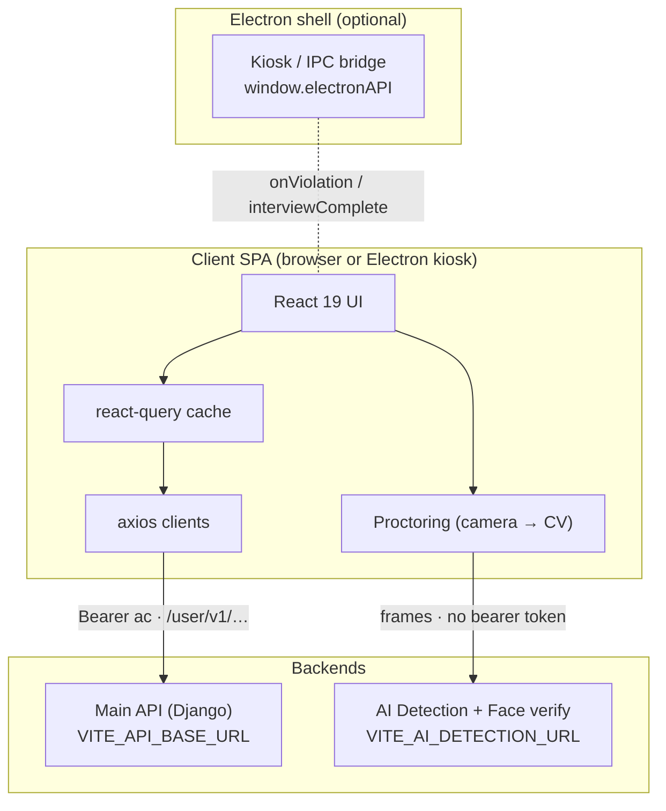
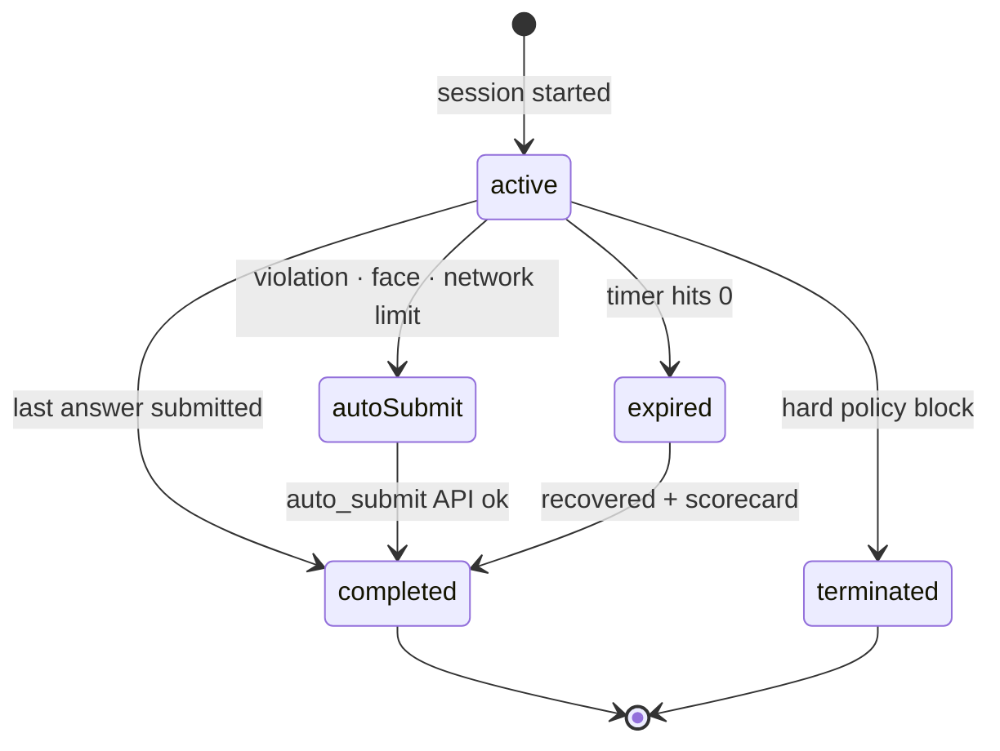

# Architecture

How the interview site is put together. Proctoring has its own page: [proctoring.md](proctoring.md).

- [Tech stack](#tech-stack)
- [Environment](#environment)
- [Project structure](#project-structure)
- [How the pieces fit](#how-the-pieces-fit)
- [Candidate flow](#candidate-flow)
- [Routing and auth](#routing-and-auth)
- [API surface](#api-surface)
- [Desktop app](#desktop-app)
- [Testing](#testing)

## Tech stack

| Area          | Choice                                                          |
| ------------- | --------------------------------------------------------------- |
| Framework     | React 19 + Vite 8 (`@vitejs/plugin-react`)                      |
| Routing       | react-router v7 data router (`createBrowserRouter`)             |
| Server state  | @tanstack/react-query v5 (mutations)                            |
| HTTP          | axios (per-backend clients, auth + refresh interceptors)        |
| i18n          | i18next + react-i18next, 19 locales, 4 namespaces               |
| Styling       | Tailwind CSS v4 (`@tailwindcss/vite`), `tw-animate-css`         |
| UI            | Radix UI / shadcn-style primitives, `lucide-react`              |
| On-device CV  | `@mediapipe/tasks-vision` (BlazeFace, EfficientDet-Lite0)       |
| Audio         | Native MediaRecorder (`audio/webm;opus`, `audio/mp4` on Safari) |
| Notifications | sonner                                                          |
| Testing       | Vitest + Testing Library (jsdom)                                |
| Tooling       | ESLint 10, Prettier 3, pnpm                                     |

**Path aliases** (`vite.config.js`, `vitest.config.js`, `jsconfig.json`; keep all three in sync): `@` → `src`, plus `@components`, `@pages`, `@router`, `@hooks`, `@mutations`, `@lib`, `@services`.

## Environment

Copy `.env.example` → `.env`. **Never** add a trailing slash to a URL value.

| Variable                             | Required | Default | Description                                                        |
| ------------------------------------ | -------- | ------- | ------------------------------------------------------------------ |
| `VITE_API_BASE_URL`                  | ✅       | —       | Main Django API base                                               |
| `VITE_AI_DETECTION_URL`              | ✅       | —       | AI detection / face verification base                              |
| `VITE_AI_MAX_VIOLATIONS_ALLOWED`     | –        | `3`     | Proctoring strikes before auto-submit                              |
| `VITE_AI_FACE_MISMATCH_LIMIT`        | –        | `2`     | Face mismatches with no match between them before auto-submit      |
| `VITE_AI_FACE_MISMATCH_TOTAL_LIMIT`  | –        | `3`     | Face mismatches in the whole interview before auto-submit          |
| `VITE_AI_FACE_UNCLEAR_HINT_SECONDS`  | –        | `30`    | No clear face this long shows a hint                               |
| `VITE_AI_FACE_UNCLEAR_LIMIT_SECONDS` | –        | `60`    | No clear face this long counts as a mismatch                       |
| `VITE_AI_FACE_MISMATCH_BELOW`        | –        | `0.4`   | Similarity must be below this to count as a mismatch               |
| `VITE_AI_FACE_STRONG_MISMATCH_BELOW` | –        | off     | Similarity below this on a clear frame ends the interview at once  |
| `VITE_AI_MAX_INTERNET_DISCONNECTS`   | –        | `3`     | Network drops before auto-submit                                   |
| `VITE_MIN_DESKTOP_VERSION`           | –        | –       | Oldest desktop app that may start an interview (e.g. `1.4.5`)      |
| `VITE_AI_INTERVIEW_DURATION_MINUTES` | –        | `15`    | Interview length                                                   |
| `VITE_AI_TERMINATION_NOTICE_SECONDS` | –        | `12`    | How long the termination notice holds                              |
| `VITE_AI_HELD_RESTRIKE_SECONDS`      | –        | `30`    | Object or camera-off still there this long adds one more strike    |
| `VITE_AI_OBJECT_CONFIDENCE_FLOOR`    | –        | `0.35`  | Confidence an object needs before it can raise a violation         |
| `VITE_AI_PROHIBIT_LAPTOP`            | –        | `true`  | `false` stops laptops counting as prohibited objects               |
| `VITE_AI_SHADOW_LABELS`              | –        | `tv`    | Object labels logged but never shown or counted                    |
| `VITE_AI_SHADOW_RULES`               | –        | `gaze`  | Rules logged but never shown or counted; `none` enforces all       |
| `VITE_AI_LOCAL_FACE_WATCH`           | –        | `true`  | On-device face count that triggers an immediate check; `false` off |
| `VITE_AI_LOCAL_OBJECT_WATCH`         | –        | `true`  | On-device phone watch triggering an immediate check; `false` off   |
| `VITE_DEBUG_LOGS`                    | –        | `false` | `"true"` keeps verbose logs in a production build                  |

All tunables resolve through [`src/config/interview.js`](../src/config/interview.js), which coerces and falls back. Read them from there, never from `import.meta.env` directly. `VITE_*` values are inlined at build time; see [deployment.md](deployment.md) for how production gets them.

## Project structure

```
src/
├── main.jsx                    # Mounts <App>, QueryClient, i18n
├── App.jsx                     # <AppRouter> + <Toaster>
├── config/
│   ├── interview.js            # Env-backed tunables (the only reader of import.meta.env for them)
│   └── interviewRules.js       # The proctoring rules, published as /interview-rules.json
├── contract/                   # Copy of the desktop app's interview-contract.json + its test
├── router/
│   ├── AppRouter.jsx           # createBrowserRouter from routeConfig
│   ├── routeConfig.jsx         # Single source of truth for routes
│   ├── privateLoader.js        # Token gate → /unauthorized-access
│   └── InterviewFlowGuard.jsx  # Pathless layout route for private pages; desktop version gate
├── pages/                      # One per route
│   ├── EntryPoint.jsx          # "/" — token capture → redirect
│   ├── Interview.jsx           # Interview screen; wires every monitor together
│   └── RouteError.jsx · PageNotFound.jsx · UnauthorizedAccess.jsx
├── components/
│   ├── interview/              # Question shell, scorecard, warnings, camera card, termination notice,
│   │   │                       # held-violation banner, start-failed and update-required screens
│   │   └── questions/          # Typing · MCQ · Code · Voice
│   ├── ui/                     # shadcn/Radix primitives
│   └── ErrorBoundary.jsx       # Subtree boundary (crash in one panel ≠ dead page)
├── hooks/
│   ├── interview/              # useInterviewSession · usePreStart · useAutoSubmitFlow · useTerminationNotice
│   ├── proctoring/             # useProctoringSystem · useViolationMonitor · useFaceMatchMonitoring ·
│   │                           # useLocalFaceWatch · useLocalObjectWatch · useCameraIntegrity · localWatch
│   ├── electron/               # useElectronViolation · useInterviewComplete · useElectronScreenRecording
│   └── useAudioRecorder.js     # MediaRecorder wrapper (voice questions)
├── mutations/                  # react-query useMutation hooks (start, answer, auto-submit, face, voice)
├── services/
│   ├── clients/
│   │   ├── backend.js          # Main API client — auth + single-flight 401 refresh
│   │   └── aiDetection.js      # AI service client — separate origin, no bearer token
│   └── interview.api.js · face.api.js · proctoring.api.js
├── i18n/                       # Config, language registry, resolveInitialLanguage, locales/<lang>/<ns>.json
│                               # (language is set by the desktop app via ?lang=; no in-page picker)
├── lib/
│   ├── strikePolicy · violationStabilizer · incidentTracker · baselineTracker   # strike decisions
│   ├── electronViolations · desktopExit · desktopVersion · electronRecording · rulesAck # desktop app
│   ├── cameraSource · cameraCheck                                                # camera
│   ├── terminationReasons · violationCopy · violationLog · startFailure          # endings and copy
│   ├── localFaceDetector · localObjectDetector · objectDetector.worker · mediapipe # on-device CV
│   └── videoCapture · answerDraft · codeEditing · correlation · logger · utils
├── dev/                        # Fake desktop app, proctoring-log timeline (dev builds only)
└── test/setup.js
scripts/                        # mockApi.js (pnpm dev:mock) · shadow-report.js (pnpm shadow:report)
```

There is no `queries/` folder: the site only has mutations. Plain reads live in `services/`.

**Layering rule:** components render, **hooks own behavior/state**, **services own network**. Never call axios from a component.

## How the pieces fit



The two backends are **separate origins with separate contracts**. The AI service takes no bearer token: adding one would force a CORS preflight it does not allow.

## Candidate flow



- **Before the clock starts** ([`usePreStart`](../src/hooks/interview/usePreStart.js)): in a browser, the rules and then the camera check. In the desktop app the candidate already read the rules on its last setup step and passed its identity check, so when `rules_acknowledged` matches [`interviewRules`](../src/config/interviewRules.js) the interview starts straight away; if the app's copy was out of date, only the rules are shown. The limits are published at build time as `/interview-rules.json` for the app to read.
- **Absolute timer:** `end_time = now + DURATION`, persisted to `sessionStorage`, so a refresh never resets the clock.
- **Crash/refresh recovery:** the whole session rehydrates from `sessionStorage` under `interview_session`.
- **Every termination path** converges on one `autoSubmit()` guarded by an in-flight ref, so overlapping triggers can't submit twice. Reasons are stable codes from [`lib/terminationReasons.js`](../src/lib/terminationReasons.js), never free text, since they drive both i18n lookup and UI copy.
- **TerminationNotice** explains _why_ the interview ended and holds the screen for `VITE_AI_TERMINATION_NOTICE_SECONDS` while submission proceeds underneath.
- **Start failures** (`lib/startFailure.js`): no attempts left, refused, network or server. Network and server errors can be retried; the others release the desktop lockdown and offer Back to dashboard (`InterviewStartFailed`).

## Routing and auth

```
/                     → EntryPoint (token capture → redirect /interview)
/interview            → privateLoader → InterviewFlowGuard → Interview (lazy)
/unauthorized-access  → UnauthorizedAccess (lazy)
*                     → PageNotFound
```

Routes are declared once in [`routeConfig.jsx`](../src/router/routeConfig.jsx). The `/interview` route sits under a pathless layout route guarded by `privateLoader`; if `ac` or `rc` is missing from `sessionStorage` it redirects before the component mounts.

The candidate normally arrives via a tokenized link, `/?ac=<access_token>&rc=<refresh_token>`. `EntryPoint` captures `ac`/`rc` into `sessionStorage`, strips them from the URL, and redirects to `/interview`. In the desktop app, the tokens are already in `sessionStorage`.

## API surface

Main-API calls go through [`services/clients/backend.js`](../src/services/clients/backend.js), which attaches `Authorization: Bearer <ac>` and `Accept-Language`, and on **401** transparently calls `/user/v1/login_refresh/`, updates tokens, and replays queued requests (single-flight refresh). A failed refresh clears the session and redirects.

| Domain           | Method & path                                                | Service fn             |
| ---------------- | ------------------------------------------------------------ | ---------------------- |
| **Interview**    | `POST /user/v1/candidate/interview/ai/start/`                | `fetchQuestion`        |
|                  | `POST /user/v1/candidate/interview/ai/answer/`               | `submitAnswer`         |
|                  | `POST /user/v1/candidate/interview/ai/auto_submit/force/`    | `autoSubmitInterview`  |
| **Voice**        | `POST /user/v1/candidate/interview/voice_enroll/`            | `enrollVoice`          |
|                  | `POST /user/v1/candidate/interview/voice_compare/`           | `compareVoice`         |
| **Proctoring**   | `POST /user/v1/candidate/interview/proctoring/log/`          | `submitProctoringLogs` |
| **Auth**         | `POST /user/v1/login_refresh/`                               | response interceptor   |
| **CV detection** | `POST {AI}/api/v1/detect`                                    | `detectFrame`          |
| **Face verify**  | `POST {AI}/continuous-verify/verification/register-face`     | `registerFace`         |
|                  | `POST {AI}/continuous-verify/verification/continuous-verify` | `continuousVerify`     |

## Desktop app

The SPA detects the desktop app via `window.electronAPI` and **no-ops in the browser**, so one build runs in both. What the app promises is in [`src/contract/interview-contract.json`](../src/contract/interview-contract.json), a copy of the app repo's `contract/interview-contract.json` (the app's `docs/web-contract.md` explains it). `src/contract/interviewContract.test.js` fails if a code in it has no mapping here.

- [`useElectronViolation`](../src/hooks/electron/useElectronViolation.js): violations from the desktop app, acknowledged by id and handled once. See [proctoring.md](proctoring.md#desktop-app-violations).
- [`useInterviewComplete`](../src/hooks/electron/useInterviewComplete.js): signals the shell exactly once when the session ends, so it can lift the lockdown.
- [`useElectronScreenRecording`](../src/hooks/electron/useElectronScreenRecording.js): screen capture lifecycle tied to session state, and `onProctoringError`.
- [`desktopExit`](../src/lib/desktopExit.js): `abortInterview` for a start that failed; `interviewComplete` + `viewDashboard` for older app builds that don't have it.
- [`desktopVersion`](../src/lib/desktopVersion.js): reads `LetsHyreSecureInterview/<version>` from the user agent for the `VITE_MIN_DESKTOP_VERSION` gate.

## Testing

```bash
pnpm test          # single run
pnpm test:watch    # watch mode
```

Vitest + Testing Library in jsdom (`src/test/setup.js`), globals enabled: no need to import `describe`/`it`/`expect`. Colocate a test as `<module>.test.js` beside its subject.

Coverage is weighted toward logic that can end someone's interview: the session state machine, every auto-submit trigger, violation counting and suppression, detection stabilization, and termination-reason copy resolution. `src/hooks/proctoring/detectionLog.regression.test.js` replays a real session (`__fixtures__/detectionLog.json`) in which a phone on camera raised no warning, so a threshold change that would miss it again fails.

> When a module is moved or renamed, update its `vi.mock(...)` specifier to match the new import path exactly. Vitest resolves mocks by specifier, and a stale one fails loudly.
